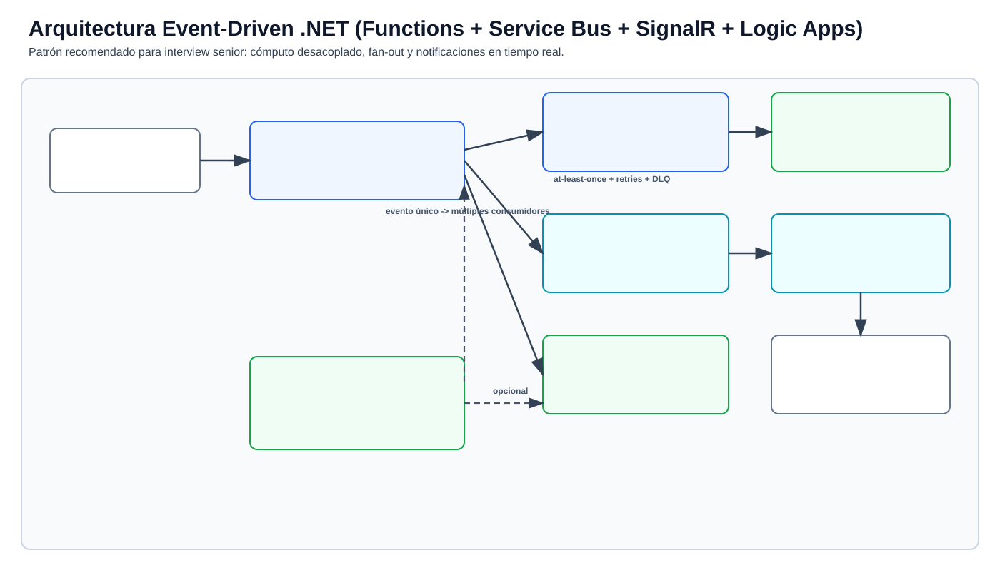

# Interview Pack: .NET Event-Driven (Functions + Service Bus + SignalR + Logic Apps)

Este repositorio contiene un **paquete práctico para preparar una entrevista técnica senior** orientada a integración en Azure:

- Guía de narrativa y conceptos senior.
- Mini proyecto de Azure Functions (Service Bus + SignalR + Timer).
- Ejemplo de workflow de Logic Apps con trigger diario.
- Diagrama visual de arquitectura listo para usar en la entrevista.

## Estructura

- `docs/arquitectura-event-driven-dotnet.md`: guía profesional para explicar arquitectura y decisiones.
- `docs/arquitectura-event-driven-diagrama.svg`: diagrama completo de la arquitectura.
- `src/Interview.FunctionsDemo/`: ejemplo base de Function App en .NET aislado.
- `logicapps/daily-contract-summary.logicapp.json`: ejemplo de scheduler diario.

## Diagrama de arquitectura

## Cómo usarlo para la interview

1. Empezá con el problema: desacople y procesamiento asíncrono.
2. Explicá por qué `topic/subscription` vs `queue`.
3. Mostrá cómo el evento impacta real-time vía SignalR.
4. Cerrá con Logic Apps para orquestación/scheduling.

## Elevator pitch

> "Functions para lógica, Service Bus para desacople, SignalR para tiempo real, Logic Apps para orquestación."
